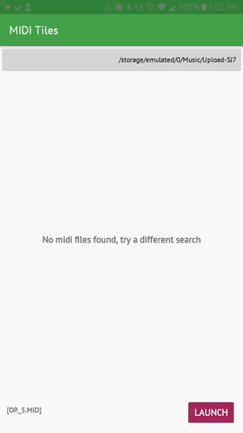
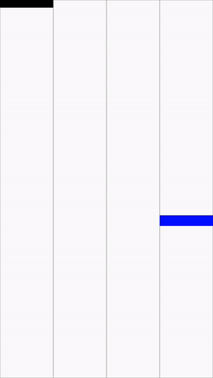

# MIDI Tiles
Play your own piano compositions & MIDI files using this app!

Over the past two days, I challenged myself to build a game like Piano Tiles, but with the ability to import your own songs. MP3 files would be too difficult to decode and translate into piano 'notes' with distinct durations, so I turned to MIDI files, which is the current standard for electronic music recording. To generate MIDI files, I used MuseScore, which output files at a resolution of 480 ticks. To read MIDI files, I used [android-midi-lib](https://github.com/leffelmania/android-midi-lib), which is based on javax.sound.midi, as Android development does not provide access to that package. 

Music is played using Android's MediaPlayer - since I wasn't able to read and play individual notes, the MediaPlayer needs to seek to the new location every time a tile is tapped. Once I figure out reading in specific notes from the MIDI file, playing more complicated MIDI files (such as with more than 2-3 voices) shouldn't be an issue.

Below is a demonstration of choosing a directory & picking a .mid file:

 

Playing the song and reaching the end:

 
